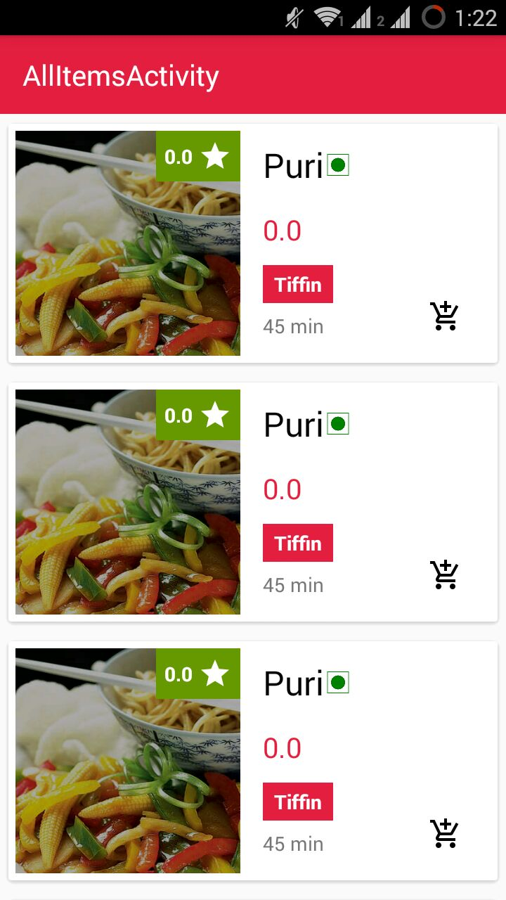
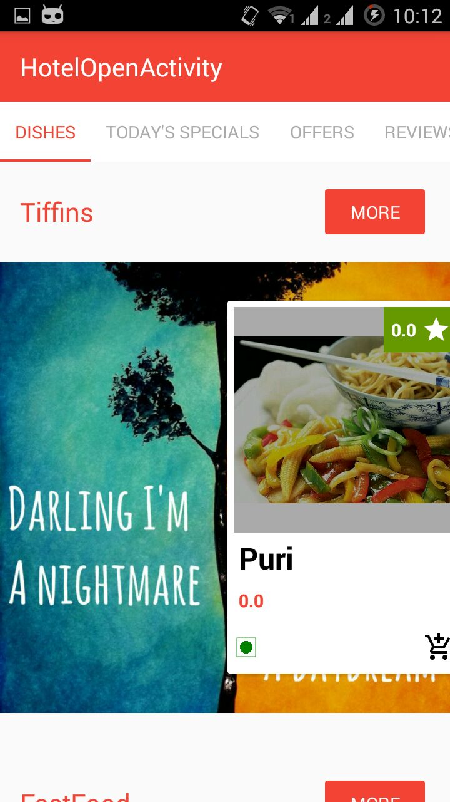
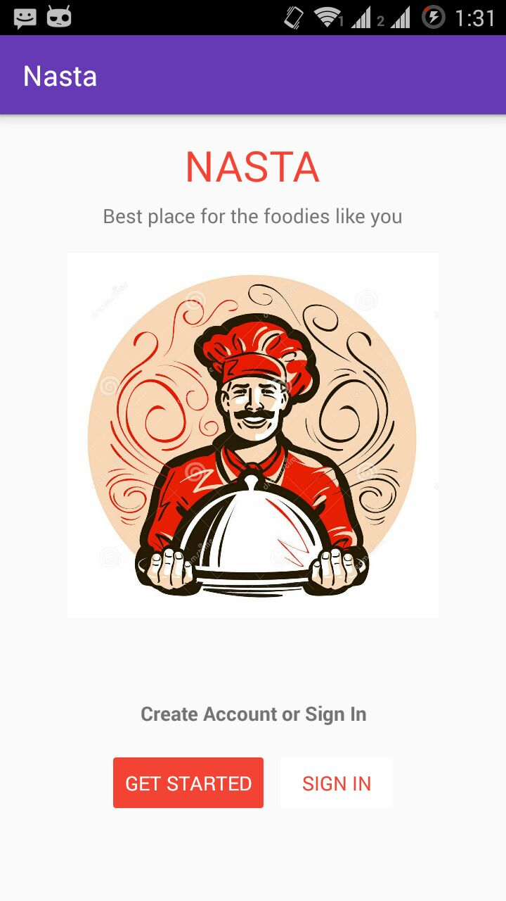

# Nasta
Online Food Ordering App

User can order food online and see the status in real time

<h1> Status : In Progress</h1>
<h1><a href="https://github.com/saitejdandge/Nasta-Android-Application/blob/master/Nasta-com.tdevelopers.nasta-1-v1.0.apk">APK</a></h1>
<h1>Technicalities</h1>
   
  
  <b><li>Mongo Database</li></b>
  <b> <li>Google Cloud Messaging</li></b>
   <b> <li>Picasso Image Loader</li></b>
    <b><li>Palette Color Detection</li></b>
   <b> <li>Firebase Invites</li></b>
    <b><li>REST API calls</li></b>
    
<h1>Screens</h1>

<table>
<tr>

<th></th>
<th></th>

<th></th>
</tr>
<tr>

<th></th>
</tr>
<table>

    

